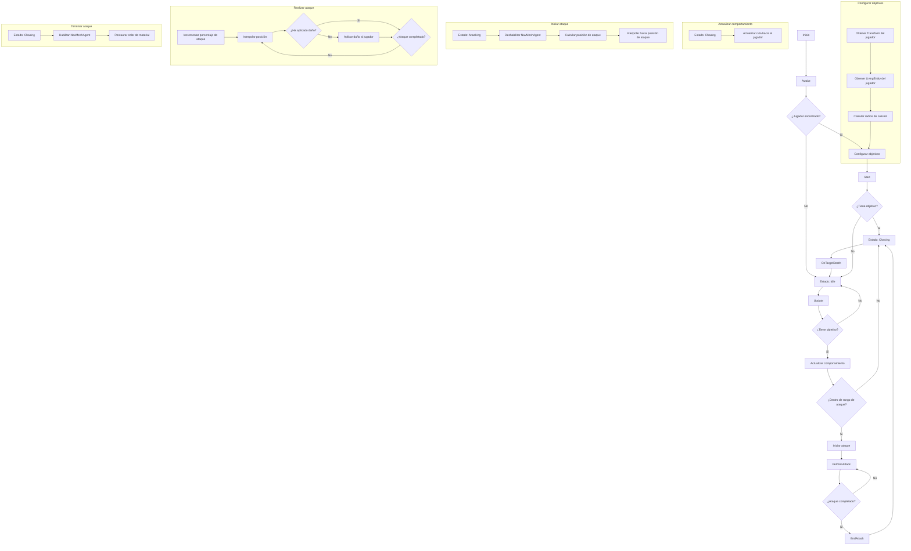
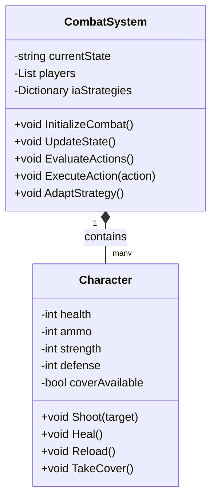

# IAV - PROYECTO FINAL DE SHOOTER EN TERCERA PERSONA CON INTELIGENCIA ADAPTATIVA

## Autores
- Dorjee Khampa Herrezuelo Blasco (neutronbomb23)
- Pablo Martínez Quesada (Ares75643)

## Propuesta
Este proyecto implementa inteligencia artificial avanzada en un juego de disparos en tercera persona. La IA será capaz de adaptar dinámicamente su estrategia usando Apex Utility AI para evaluar probabilidades y el impacto de diferentes acciones en función del estado cambiante del juego. Las estrategias pueden incluir la gestión eficiente de munición, elegir los momentos adecuados para curarse y decidir cuándo cubrirse.

### Escenario del Juego
El juego se desarrolla en un entorno de combate donde los personajes de la IA enfrentan a un oponente que puede ser otro jugador o una segunda IA con estrategias distintas. El objetivo es demostrar la capacidad de adaptación de la IA en un entorno competitivo y dinámico.

### Mecánica de Juego
- **Tiempo Real:** El juego opera en tiempo real, donde las decisiones estratégicas de la IA se evalúan continuamente.
- **Aprendizaje y Adaptación de la IA:** La IA evalúa su rendimiento y adapta su estrategia en función del análisis en tiempo real del estado del juego y las acciones del oponente.

## Plataforma de Desarrollo
Se utilizará Unity 2022.3.5f1 junto con Apex Utility AI para desarrollar un entorno interactivo y visualmente atractivo. El código y los recursos estarán disponibles en un repositorio de GitHub proporcionado por el profesor.

## Estructura del Proyecto
### Clase `CombatSystem`

Gestiona la lógica de combate y las decisiones de la IA.

#### Propiedades
- `currentState`: Estado actual del combate.
- `players`: Lista de personajes en el combate.
- `iaStrategies`: Diccionario de estrategias disponibles para la IA.

#### Métodos
- `InitializeCombat()`: Prepara el campo de batalla y establece los participantes.
- `UpdateState()`: Actualiza el estado del combate en tiempo real.
- `EvaluateActions()`: Utiliza Apex Utility AI para determinar la mejor acción en función de la estrategia actual.
- `ExecuteAction(action)`: Aplica la acción elegida en el campo de batalla.
- `AdaptStrategy()`: Evalúa los resultados y ajusta la estrategia de la IA si es necesario.

### Clase `Character`

Define las características y capacidades de los personajes del juego.

#### Propiedades
- `health`: Vida del personaje.
- `ammo`: Munición disponible.
- `strength`: Poder de ataque.
- `coverAvailable`: Indica si hay cobertura disponible.

#### Métodos
- `Shoot(target)`: Dispara a un objetivo.
- `Heal()`: Restaura salud.
- `Reload()`: Recarga la munición.
- `TakeCover()`: Busca cobertura para reducir daño recibido.

## Estrategias de la IA
La IA puede alternar entre tres estrategias principales, que se evalúan y ajustan continuamente:
1. **Ammo Conservation (AC):** Gestiona la munición de forma eficiente, priorizando disparos precisos.
2. **Health Management (HM):** Prioriza curarse cuando la salud es baja.
3. **Cover Utilization (CU):** Utiliza la cobertura de manera efectiva para minimizar el daño recibido.

## Diagrama de Clases

### Pruebas y Evaluación
Las pruebas se centrarán en la efectividad de las estrategias de IA, midiendo la capacidad de adaptación y la toma de decisiones en situaciones de combate variadas. Se utilizarán métricas como tasa de victoria, uso eficiente de recursos (munición y vida) y cambios de estrategia efectuados.

### Documentación y Repositorio
La documentación completa del proyecto, incluyendo código, recursos y un vídeo demostrativo, estará disponible en un repositorio de GitHub. Esto permitirá una revisión detallada del enfoque y la implementación de las estrategias de IA en un entorno de combate dinámico.
