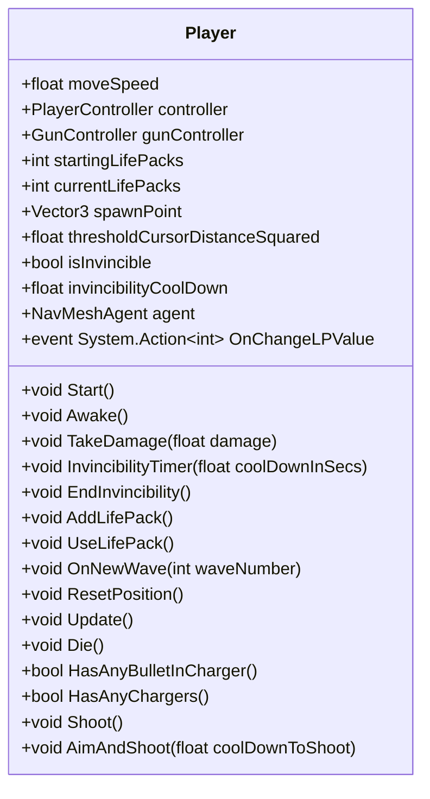
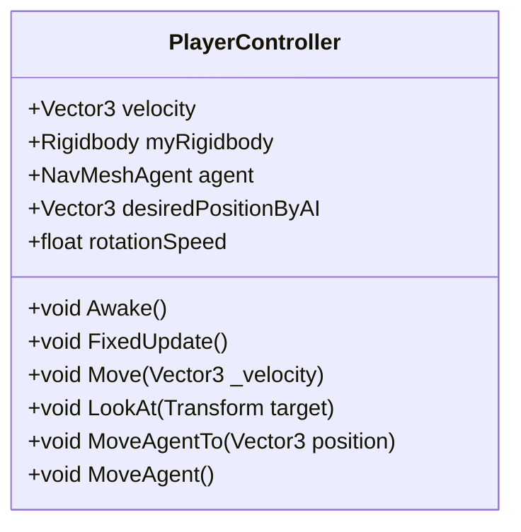
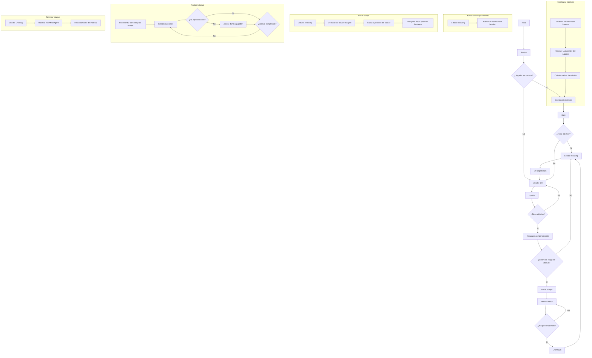
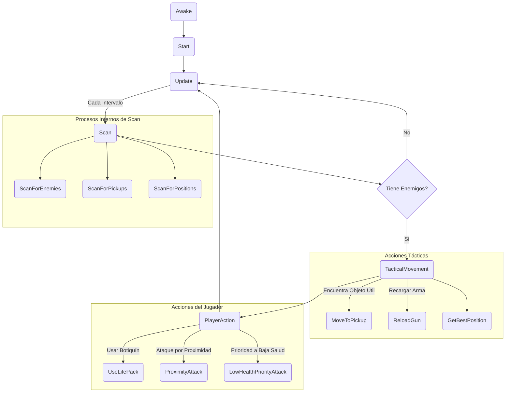

# IAV - PROYECTO FINAL DE SHOOTER EN TERCERA PERSONA CON INTELIGENCIA ADAPTATIVA

## Autores
- Dorjee Khampa Herrezuelo Blasco (neutronbomb23)
- Pablo Martínez Quesada (Ares75643)

## Propuesta
Este proyecto implementa inteligencia artificial avanzada en un juego de disparos en tercera persona. La IA será capaz de adaptar dinámicamente su estrategia usando Apex Utility AI para evaluar probabilidades y el impacto de diferentes acciones en función del estado cambiante del juego. Las estrategias pueden incluir la gestión eficiente de munición, elegir los momentos adecuados para curarse y decidir cuándo cubrirse.

### Escenario del Juego
El juego se desarrolla en un entorno de combate donde los personajes de la IA enfrentan a un oponente que puede ser otro jugador o una segunda IA con estrategias distintas. El objetivo es demostrar la capacidad de adaptación de la IA en un entorno competitivo y dinámico.

### Mecánica de Juego
- **Tiempo Real:** El juego opera en tiempo real, donde las decisiones estratégicas de la IA se evalúan continuamente.
- **Aprendizaje y Adaptación de la IA:** La IA evalúa su rendimiento y adapta su estrategia en función del análisis en tiempo real del estado del juego y las acciones del oponente.

### Humanización de la IA
La IA se ha diseñado para comportarse de manera más humana, incluyendo la capacidad de fallar disparos y rotar de manera natural. Además, los enemigos tienen distintas cantidades de vida, añadiendo variedad al enfrentamiento.

### **Modos de Ataque de la IA**
El jugador puede alternar entre dos modos de ataque presionando la tecla "L":
- Ataque al enemigo con menos vida.
- Ataque al enemigo más cercano.

## Plataforma de Desarrollo
Se utilizará Unity 2022.3.5f1 junto con Apex Utility AI para desarrollar un entorno interactivo y visualmente atractivo. El código y los recursos estarán disponibles en un repositorio de GitHub proporcionado por el profesor.

## Estructura del Proyecto
### Clase `Player`

## Diagrama de Clases
### Diagrama de Funcionamiento del Enemigo

### AI MANAGER

### Características Principales
- **Administración de comportamientos:** Permite alternar entre dos comportamientos principales (ataque por proximidad y prioridad a enemigos con baja salud) mediante la tecla "L".
- **Escaneo y detección:** Periodicamente escanea el entorno en busca de enemigos y objetos útiles dentro del rango especificado.
- **Movimiento táctico:** Decidir si moverse hacia un objeto útil o reposicionarse estratégicamente en el campo de batalla según la situación.
- **Acciones de combate:** Decide cuándo recargar el arma, usar botiquines de salud, o iniciar un ataque según el comportamiento configurado.
- **Selección de objetivos y ataque:** Calcula el objetivo más adecuado y realiza el ataque cuando es oportuno.

### Diagrama de Flujo del `AIManager`

Este diagrama visualiza cómo el AIManager interactúa con sus subcomponentes y gestiona el flujo de decisión para controlar las acciones del personaje de IA en tiempo real. Cada función y decisión se realiza en base a la situación actual del juego, lo que permite una adaptación y respuesta dinámica a las circunstancias cambiantes del entorno y las tácticas del enemigo.
--- 

### Pruebas y Evaluación
Las pruebas se centrarán en la efectividad de las estrategias de IA, midiendo la capacidad de adaptación y la toma de decisiones en situaciones de combate variadas. Se utilizarán métricas como tasa de victoria, uso eficiente de recursos (munición y vida) y cambios de estrategia efectuados.

### Vídeo Demostrativo
Un vídeo demostrativo del proyecto está disponible en el siguiente enlace: [link VIDEO](https://youtu.be/pM_U1lsDRuc)

### Documentación y Repositorio
La documentación completa del proyecto, incluyendo código, recursos y un vídeo demostrativo, estará disponible en un repositorio de GitHub. Esto permitirá una revisión detallada del enfoque y la implementación de las estrategias de IA en un entorno de combate dinámico.
