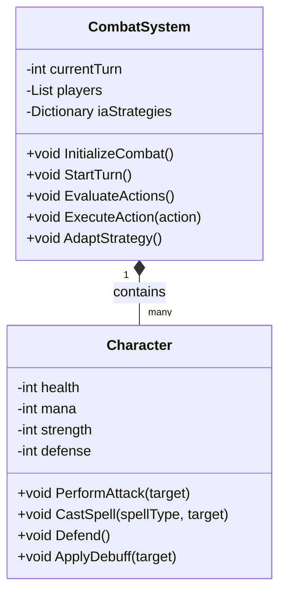

# IAV - PROYECTO FINAL DE COMBATE POR TURNOS CON INTELIGENCIA ADAPTATIVA

## Autores
- Dorjee Khampa Herrezuelo Blasco (neutronbomb23)
- Pablo Martínez Quesada (Ares75643)

## Propuesta
Este proyecto es una implementación avanzada de inteligencia artificial en un contexto de juego de combate por turnos. La IA será capaz de adaptar dinámicamente su estrategia basándose en Utility AI, que evaluará las probabilidades y el impacto de diferentes acciones en función del estado cambiante del juego. Las estrategias pueden variar entre enfocarse en eliminar a los enemigos más fuertes primero o intentar reducir el número de enemigos rápidamente.

### Escenario del Juego
El juego se desarrolla en una arena de combate donde los personajes de la IA enfrentan a un oponente que puede ser otro jugador o una segunda IA con estrategias distintas. El objetivo es demostrar la capacidad de adaptación de la IA en un entorno competitivo y altamente variable.

### Mecánica de Juego
- **Turnos:** El juego opera en un sistema de turnos donde cada lado decide sus acciones.
- **Aprendizaje y Adaptación de la IA:** La IA evalúa su rendimiento y adapta su estrategia en función del análisis en tiempo real del estado del juego y las acciones del oponente.

## Plataforma de Desarrollo
Se utilizará Unity 2022.3.5f1 para desarrollar un entorno interactivo y visualmente atractivo. El código y los recursos estarán disponibles en un repositorio de GitHub proporcionado por el profesor.

## Estructura del Proyecto
### Clase `CombatSystem`

Gestiona la lógica de combate y las decisiones de la IA.

#### Propiedades
- `currentTurn`: Turno actual en el combate.
- `players`: Lista de personajes en el combate.
- `iaStrategies`: Diccionario de estrategias disponibles para la IA.

#### Métodos
- `InitializeCombat()`: Prepara el campo de batalla y establece los participantes.
- `StartTurn()`: Comienza un nuevo turno, activando la toma de decisiones para la IA o el jugador.
- `EvaluateActions()`: Utiliza Utility AI para determinar la mejor acción en función de la estrategia actual.
- `ExecuteAction(action)`: Aplica la acción elegida en el campo de batalla.
- `AdaptStrategy()`: Evalúa los resultados y ajusta la estrategia de la IA si es necesario.

### Clase `Character`

Define las características y capacidades de los personajes del juego.

#### Propiedades
- `health`: Vida del personaje.
- `mana`: Puntos de maná para habilidades especiales.
- `strength`: Poder de ataque físico.
- `defense`: Capacidad defensiva.

#### Métodos
- `PerformAttack(target)`: Ejecuta un ataque físico contra un objetivo.
- `CastSpell(spellType, target)`: Utiliza habilidades mágicas según el tipo de hechizo y el objetivo.
- `Defend()`: Aumenta la defensa durante el turno.
- `ApplyDebuff(target)`: Reduce las estadísticas del objetivo temporalmente.

*Aún no sabemos bien si usaremos estas clases como tal, ya que aún no hemos encontrado el repositorio en el que nos vamos a fijar, pero damos por hecho que habrá algo parecido. 

## Estrategias de la IA
La IA puede alternar entre dos estrategias principales, que se evalúan y ajustan continuamente:
1. **Target the Strongest (TTS):** Prioriza ataques contra los enemigos con mayor capacidad ofensiva.
2. **Eliminate the Weakest (ETW):** Busca eliminar rápidamente a los enemigos con menos salud para reducir el número de ataques recibidos en los turnos siguientes.

## Diagrama de Clases

## Pruebas y Evaluación
Las pruebas se centrarán en la efectividad de las estrategias de IA, midiendo la capacidad de adaptación y la toma de decisiones en situaciones de combate variadas. Se utilizarán métricas como tasa de victoria, supervivencia de personajes y cambios de estrategia efectuados.

## Documentación y Repositorio
La documentación completa del proyecto, incluyendo código, recursos y un vídeo demostrativo, estará disponible en un repositorio de GitHub. Esto permitirá una revisión detallada del enfoque y la implementación de las estrategias de IA en un entorno de combate dinámico.
